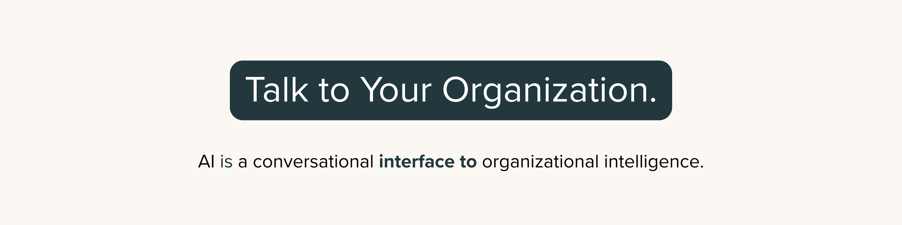

  

# Hi, I'm Ariana

### Growth Intelligence for Socially Impactful Organizations  

I build the **maps and systems** that make AI usable, trustworthy, and aligned with the realities of leading mission-driven, socially impactful organizations.

Most teams don’t have an AI problem — they have a **systems and workflow problem**. I care less about shiny tools and more about whether your AI actually supports how your organization thinks, decides, and grows.

---

## What I’m Working On

### Mōmap — Workflow Intelligence for Mission-Driven Orgs  
I’m building **Mōmap**, an AI-driven workflow intelligence layer that helps small and midsize, socially impactful organizations:

- Map their real-world workflows  
- Identify **high-impact AI opportunities** (before overspending on tools)  
- Design Claude-first, human-centered systems that can scale responsibly  

> Code and experiments here will often explore: workflow modeling, orchestration patterns, retrieval, and evaluation strategies for AI-in-the-loop systems.

---

### Smart Maps — AI Clarity in One Sketch  
[**Smart Maps**](#) (link your Beehiiv) is my weekly napkin-sketch newsletter for **non-technical leaders** who need AI to make sense:

- One sketch  
- One insight  
- One step forward  

I use Smart Maps to translate the kinds of systems and architectures I prototype here on GitHub into **plain language and visuals** that executives can actually use.

---

### OmniQ — Organizational Intelligence Research  
**OmniQ** is my ongoing research into how organizations:

- Encode knowledge  
- Make decisions  
- Adapt under constraints  
- Fail or thrive with AI systems  

On GitHub, that looks like:
- notebooks on organizational cognition & decision flows  
- experiments with “organizational memory” structures  
- Claude-first architectures for trustworthy, auditable systems  

---

## What You’ll Find in My Repos

- **Claude-first system architectures** for SMEs and impact orgs  
- **Workflow mapping & simulation** for operations, grants, and service delivery  
- **AI-in-the-loop prototypes** (routing, review flows, semi-automated decisions)  
- **Infrastructure for non-technical teams** – patterns that don’t assume a giant eng org  
- Early explorations in **organizational intelligence** and growth infrastructure

I care a lot about:

- making AI **legible** to leaders  
- designing systems that can be **safely delegated to**  
- keeping humans in the loop without burning them out  

---

## Areas of Focus

- AI Systems Architecture (Claude-first)  
- Workflow Intelligence & Operational Mapping  
- Organizational Intelligence & Decision Systems  
- AI Strategy & Implementation for SMEs  
- Mission-Driven / Socially Impactful Organizations  

---

## Connect / Work With Me

- 🟣 **Smart Maps** – weekly AI clarity in one sketch →   
- 🟢 **Website / Portfolio** → [ariabramson.com](https://www.ariabramson.com/)  
- 🟠 **LinkedIn** → [linkedin.com/in/arianaabramson](https://www.linkedin.com/in/arianaabramson)  
- ⚪️ **Speaking / Collaboration** → [Send me a note](https://www.ariabramson.com/speaking/)

---

> *“Most leaders don’t need more AI. They need systems that understand how they actually work — and help them think ahead.”*

